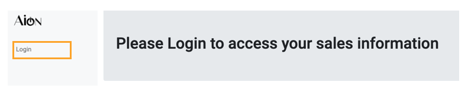
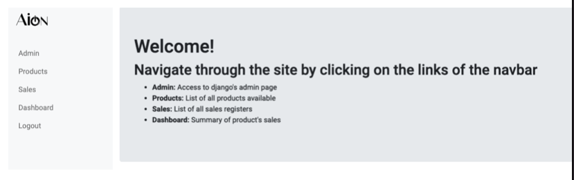
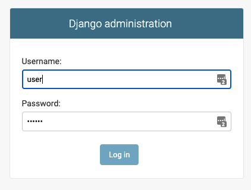
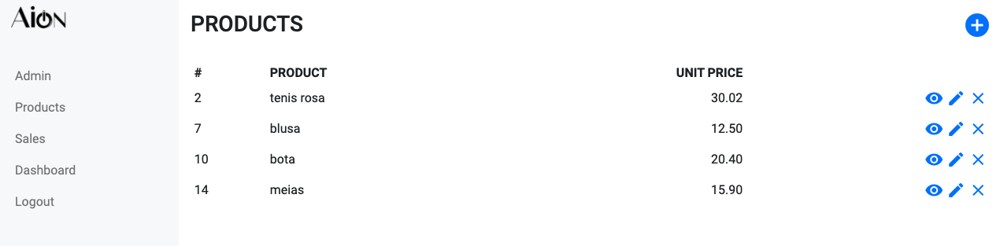
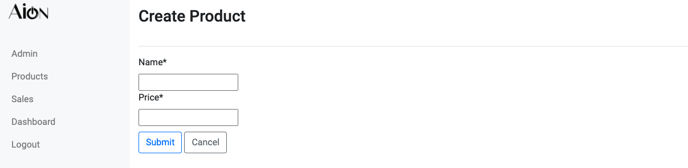
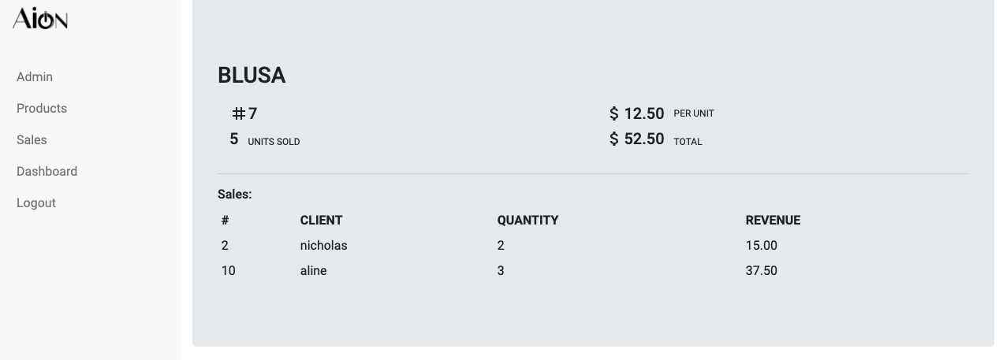
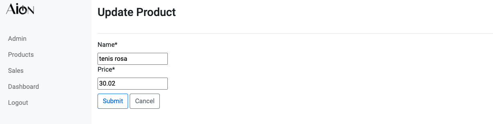
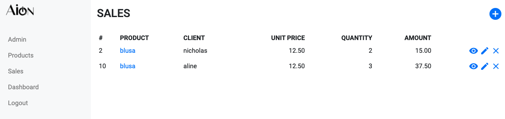
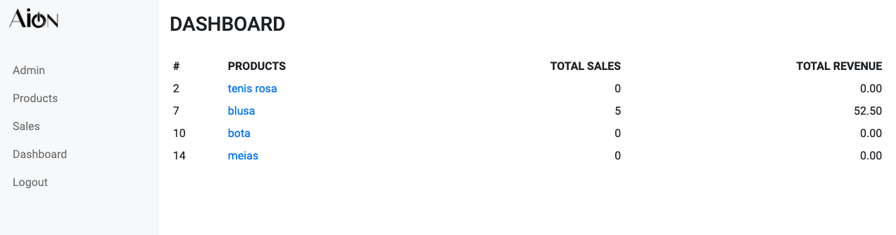

# Django-sales-dataset
This is a simple app of products and sales registration made with [DJANGO](https://www.djangoproject.com/).
You can access it [here](https://alineayumi.pythonanywhere.com/)
## Motivation
Django is a free and open source web framework, used by many sites including Pinterest, Instagram, Mozilla etc.
It was created in 2003, when web developers from Lawrence Journal-World newspaper started using Pyhton for their development. As the original developers were good writers, django has really good [documentation](https://docs.djangoproject.com/en/3.1/).

## Installation
To run the app locally, you should to clone this repo:
```
git clone https://github.com/alineayumi/django-sales-dataset.git
```

Before running the app, make sure all migrations were made, this will let django to do the heavy lifting of creating SQL databases:
```
cd sales_project
python manage.py migrate
python manage.py makemigrations sales_app
```

After that you are ready to run the app :) 
```
python manage.py runserver
```

You will see something like this in your command line:
```
(MyDjangoEnv) sales_project % python manage.py runserver
Watching for file changes with StatReloader
Performing system checks...

System check identified no issues (0 silenced).
February 24, 2021 - 22:28:36
Django version 3.1.7, using settings 'sales_project.settings'
Starting development server at http://127.0.0.1:8000/
Quit the server with CONTROL-C.
```

Copy and Paste the url to your browser and you are ready to go: `http://127.0.0.1:8000/`

## How to use
To access the main application tables, click on login:
This is a fake login. I wanted to make the flow so I can implement authentication later :)


You will see something like this:


### Admin

This is the page to access django's admin page. You need to have a user login to access it:
```
python manage.py createsuperuser
```
```
Username: user
Email address: user@email.com
Password: 
Superuser created successfully.
```
Now when you click on admin's tab, you can use the credentials you just created.
You can access all database and also manipulate :)


### Products
In this tab you will the the list of all products registered.


You can add a new product by clicking on the '+'icon:


See product details clicking on the 'eye' icon:


Edit it by clicking on the 'pencil' icon:


And delete it with the 'X':


## Sales
Sales has the same dynamic as products (add, edit, view and delete).

ps: when creating a new sale it will only ask for product, quantity and client. The amount calculus is made once the submit button is pressed. Based on the product it will get its price and multiply by the quantity to get its value.
## Dashboard
The dashboard consolidates the data from products and sales, showing the total od sales and the total revenue by product.


## Logout
At the end, you could fakelly logout to return to the first screen :)
